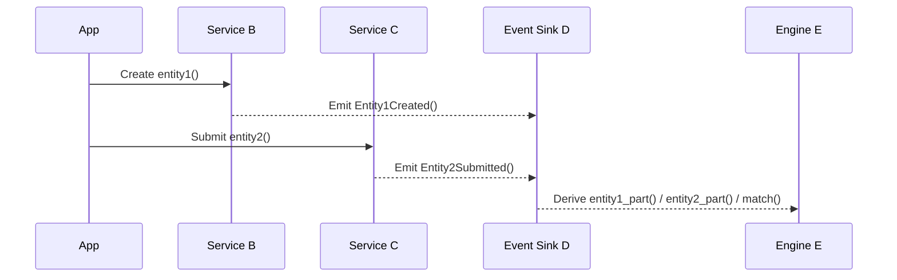

# Sequence Diagram  

(ACH->LOCKBOX)

```mermaid
sequenceDiagram
    %% PARTICIPANTS
    participant A as App
    participant B as Service B
    participant C as Service C
    participant D as Event Sink D
    participant E as Engine E

    %% 1. ENTITY_1 CREATION
    A->>B: Create entity1()
    B-->>D: Emit Entity1Created()

    %% 2. ENTITY_2 CREATION AND SUBMISSION
    A->>C: Submit entity2()
    C-->>D: Emit Entity2Submitted()
    D-->>E: Derive entity1_part() / entity2_part() / match()
```
