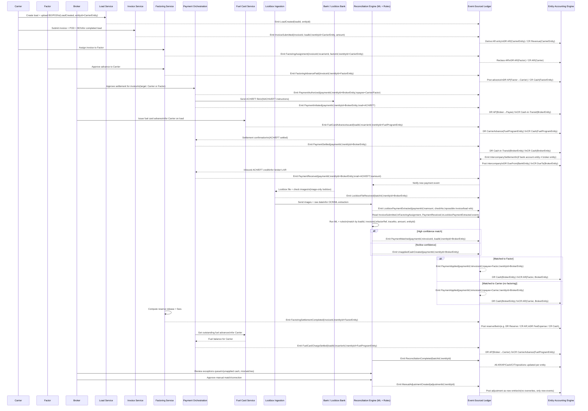

# Sequence Diagram (ACH->LOCKBOX)

```mermaid
sequenceDiagram
    %% PARTICIPANTS
    participant C as Carrier
    participant F as Factor
    participant B as Broker
    participant Ld as Load Service
    participant Inv as Invoice Service
    participant Fac as Factoring Service
    participant Pay as Payment Orchestration
    participant Fuel as Fuel Card Service
    participant Lock as Lockbox Ingestion
    participant Bank as Bank / Lockbox Bank
    participant Recon as Reconciliation Engine (ML + Rules)
    participant Led as Event‑Sourced Ledger
    participant Ent as Entity Accounting Engine

    %% 1. LOAD CREATION
    C->>Ld: Create load + upload BO/POD\n(LoadCreated, entityId=CarrierEntity)
    Ld-->>Led: Emit LoadCreated(loadId, entityId)

    %% 2. INVOICE SUBMISSION (AR ORIGIN)
    C->>Inv: Submit invoice + POD + BO\nfor completed load
    Inv-->>Led: Emit InvoiceSubmitted(invoiceId, loadId,\nentityId=CarrierEntity, amount)
    Led-->>Ent: Derive AR entry\nDR AR(CarrierEntity) / CR Revenue(CarrierEntity)

    %% 3. FACTORING ASSIGNMENT (OPTIONAL)
    C->>Fac: Assign invoice to Factor
    Fac-->>Led: Emit FactoringAssignment(invoiceId,\ncarrierId, factorId,\nentityId=CarrierEntity)
    Led-->>Ent: Reclass AR\nDR AR(Factor) / CR AR(Carrier)

    %% 4. FACTOR ADVANCE TO CARRIER (AP FROM FACTOR)
    F->>Fac: Approve advance to Carrier
    Fac-->>Led: Emit FactoringAdvancePaid(invoiceId,\nentityId=FactorEntity)
    Led-->>Ent: Post advance\nDR AP(Factor→Carrier) / CR Cash(FactorEntity)

    %% 5. BROKER AP AUTHORIZATION (TO CARRIER OR FACTOR)
    B->>Pay: Approve settlement for invoice\n(target: Carrier or Factor)
    Pay-->>Led: Emit PaymentAuthorized(paymentId,\nentityId=BrokerEntity,\npayee=Carrier/Factor)

    %% 6. PAYMENT INITIATION (ACH/EFT)
    Pay->>Bank: Send ACH/EFT file\n(NACHA/EFT instructions)
    Pay-->>Led: Emit PaymentInitiated(paymentId,\nentityId=BrokerEntity,\nrail=ACH/EFT)
    Led-->>Ent: DR AP(Broker→Payee) /\nCR Cash‑in‑Transit(BrokerEntity)

    %% 7. FUEL CARD ADVANCE (AP + FUTURE OFFSET)
    B->>Fuel: Issue fuel card advance\nfor Carrier on load
    Fuel-->>Led: Emit FuelCardAdvanceIssued(loadId,\ncarrierId,\nentityId=FuelProgramEntity)
    Led-->>Ent: DR CarrierAdvance(FuelProgramEntity) /\nCR Cash(FuelProgramEntity)

    %% 8. BANK SETTLEMENT OF OUTBOUND PAYMENT
    Bank-->>Pay: Settlement confirmation\n(ACH/EFT settled)
    Pay-->>Led: Emit PaymentSettled(paymentId,\nentityId=BrokerEntity)
    Led-->>Ent: DR Cash‑in‑Transit(BrokerEntity) /\nCR Cash(BrokerEntity)

    %% 9. INTERCOMPANY (IF MULTI‑ENTITY BANK VS BROKER)
    Ent-->>Led: Emit IntercompanySettlement\n(if bank account entity ≠ broker entity)
    Led-->>Ent: Post intercompany\nDR DueFrom(BankEntity) /\nCR DueTo(BrokerEntity)

    %% 10. INBOUND CUSTOMER PAYMENT (AR SIDE)
    Bank-->>Pay: Inbound ACH/EFT credit\nfor broker’s AR
    Pay-->>Led: Emit PaymentReceived(paymentId,\nentityId=BrokerEntity,\nrail=ACH/EFT,\namount)
    Led-->>Recon: Notify new payment event

    %% 11. LOCKBOX IMAGE‑ONLY FLOW
    Bank-->>Lock: Lockbox file + check images\n(image‑only lockbox)
    Lock-->>Led: Emit LockboxFileReceived(batchId,\nentityId=BrokerEntity)
    Lock->>Recon: Send images + raw data\nfor OCR/ML extraction
    Recon-->>Led: Emit LockboxPaymentExtracted(paymentId,\namount, checkNo,\npossible invoice/load refs)

    %% 12. ML‑ASSISTED MATCHING (AR)
    Recon->>Led: Read InvoiceSubmitted,\nFactoringAssignment, PaymentReceived,\nLockboxPaymentExtracted events
    Recon->>Recon: Run ML + rules\n(match by loadId, invoiceId,\nfactorRef, traceNo, amount, entityId)
    alt High confidence match
        Recon-->>Led: Emit PaymentMatched(paymentId,\ninvoiceId, loadId,\nentityId=BrokerEntity)
    else No/low confidence
        Recon-->>Led: Emit UnappliedCashCreated(paymentId,\nentityId=BrokerEntity)
    end

    %% 13. PAYMENT APPLICATION (AR CLEARING)
    alt Matched to Factor
        Led-->>Led: Emit PaymentApplied(paymentId,\ninvoiceId,\npayee=Factor,\nentityId=BrokerEntity)
        Led-->>Ent: DR Cash(BrokerEntity) /\nCR AR(Factor, BrokerEntity)
    else Matched to Carrier (no factoring)
        Led-->>Led: Emit PaymentApplied(paymentId,\ninvoiceId,\npayee=Carrier,\nentityId=BrokerEntity)
        Led-->>Ent: DR Cash(BrokerEntity) /\nCR AR(Carrier, BrokerEntity)
    end

    %% 14. FACTOR FINAL SETTLEMENT (RESERVE, FEES)
    Fac->>Fac: Compute reserve release + fees
    Fac-->>Led: Emit FactoringSettlementCompleted(invoiceId,\nentityId=FactorEntity)
    Led-->>Ent: Post reserve/fee\n(e.g. DR Reserve / CR AR,\nDR FeeExpense / CR Cash)

    %% 15. FUEL CARD OFFSET DURING CARRIER SETTLEMENT
    Pay->>Fuel: Get outstanding fuel advances\nfor Carrier
    Fuel-->>Pay: Fuel balance for Carrier
    Pay-->>Led: Emit FuelCardChargeSettled(loadId,\ncarrierId,\nentityId=FuelProgramEntity)
    Led-->>Ent: DR AP(Broker→Carrier) /\nCR CarrierAdvance(FuelProgramEntity)

    %% 16. RECONCILIATION COMPLETION
    Recon->>Led: Emit ReconciliationCompleted(batchId,\nentityId)
    Led-->>Ent: All AR/AP/Cash/CIT\npositions updated per entity

    %% 17. MANUAL REVIEW & CORRECTION (IF NEEDED)
    B->>Recon: Review exceptions queue\n(unapplied cash, mismatches)
    B->>Recon: Approve manual match/correction
    Recon-->>Led: Emit ManualAdjustmentCreated(adjustmentId,\nentityId)
    Led-->>Ent: Post adjustment as new entries\n(no overwrites, only new events)
```
